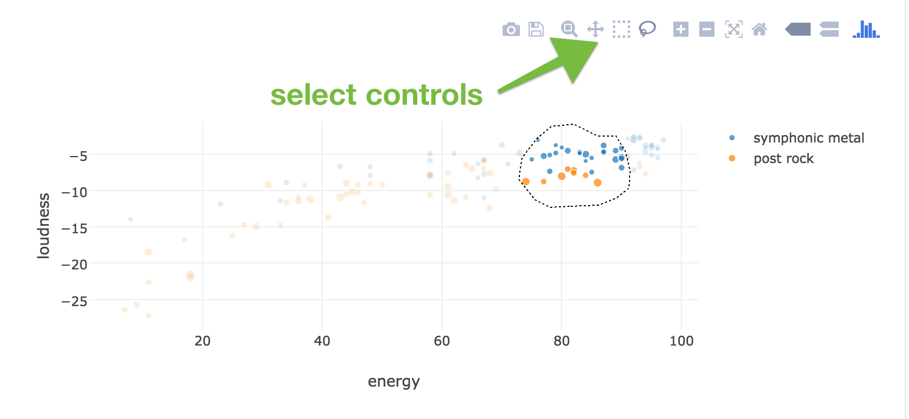
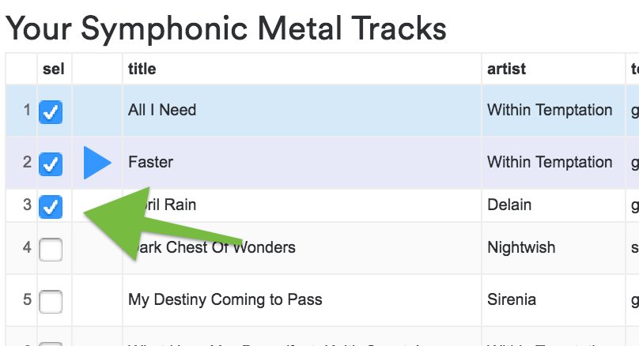

# Organize Your Music 🎵

**Organize Your Music** is a high-performance tool designed to help you take control of your Spotify library. Whether you have thousands of saved tracks or a handful of curated playlists, this tool allows you to slice and dice your music collection by a wide range of musical attributes including genre, mood, decade of release, and deep technical audio features.



## Key Features

- **Deep Categorization**: Automatically sort your music into "bins" such as Genre, Mood, Style, Decade, and Popularity.
- **Audio Feature Analysis**: Explore tracks based on Spotify's audio features:
  - **BPM (Tempo)**: Find the perfect pace for your workout.
  - **Energy & Danceability**: Measure intensity and rhythmic suitability.
  - **Valence**: Measure musical positiveness (happiness).
  - **Acousticness, Liveness, and Speechiness**.
- **Interactive Visualization**: Map your tracks on dynamic scatter plots. Customize the X and Y axes and bubble size to see how your music is distributed.
- **Audio Previews**: Listen to 30-second clips of tracks directly within the app before adding them to your list.
- **Staging & Saving**: Select tracks from different categories to build a "Staging" list and save it as a new playlist directly to your Spotify account.
- **Safe & Non-Destructive**: The tool only creates new playlists. It will never modify or delete your existing tracks or playlists.



## Tech Stack

- **Frontend**:
  - [Vite](https://vitejs.dev/) & [React](https://reactjs.org/)
  - [TailwindCSS v4](https://tailwindcss.com/) for modern, responsive styling.
  - [Google Charts](https://developers.google.com/chart) for data-rich, sortable tables.
  - [Plotly.js](https://plotly.com/javascript/) for interactive scatter plots and data visualization.
  - [jQuery](https://jquery.com/), [Underscore.js](https://underscorejs.org/), and [Moment.js](https://momentjs.com/) for core logic and data manipulation.
- **Backend**:
  - [Node.js](https://nodejs.org/) & [Express](https://expressjs.com/)
  - Acts as a proxy for the Spotify API to handle complex requests, large ID batches, and CORS.

## ⚙️ Getting Started

### Prerequisites

- [Node.js](https://nodejs.org/) (v18 or higher recommended)
- A [Spotify Developer Account](https://developer.spotify.com/dashboard/) to get your own Client ID.

### Installation

1.  **Clone the repository**:
    ```bash
    git clone https://github.com/CurtisCullenAWong/OrganizeYourMusic.git
    cd OrganizeYourMusic
    ```

2.  **Install dependencies**:
    ```bash
    npm install
    ```

3.  **Configuration**:
    Update `config.js` with your Spotify Client ID:
    ```javascript
    var SPOTIFY_CLIENT_ID = 'your_client_id_here';
    ```

### Running Locally

To start both the frontend development server and the backend proxy server:

```bash
npm run dev
```

- Frontend: `http://localhost:5173`
- Backend API Proxy: `http://localhost:8000`

### Building for Production

To create an optimized production build in the `dist/` folder:

```bash
npm run build
```

## How it Works

1. **Authentication**: Users login via Spotify OAuth.
2. **Data Fetching**: The app fetches all tracks from the user's selected collection (Saved Music, Playlists, etc.).
3. **Audio Features Enriching**: For each track, the app fetches detailed audio features from the Spotify API via the backend proxy.
4. **Binning**: Tracks are automatically categorized using predefined filters for moods, styles, and decades.
5. **Visualization**: Data is plotted using Plotly, allowing users to select clusters of tracks visually.
6. **Staging**: Selected tracks are stored in a local "Staging" state until the user decides to save.
7. **Saving**: A new playlist is created via the Spotify API, and staged tracks are added in batches of 100.

## License

This project is open-source. Please refer to the [LICENSE](LICENSE) file for more details.

---
*Created by [@plamere](https://github.com/plamere) and modernized.*

